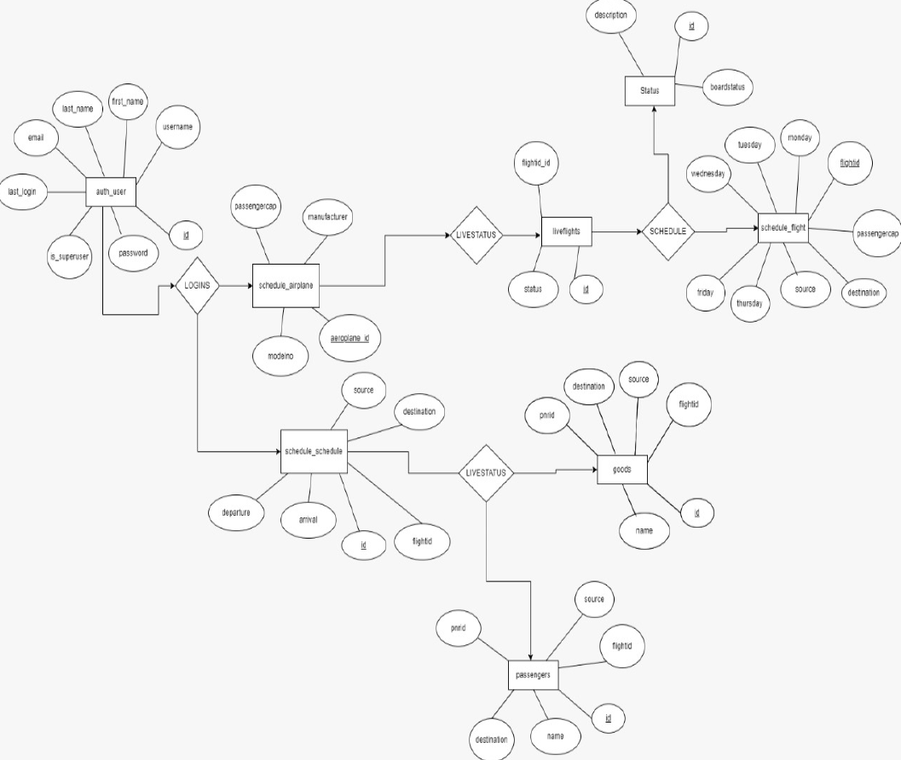
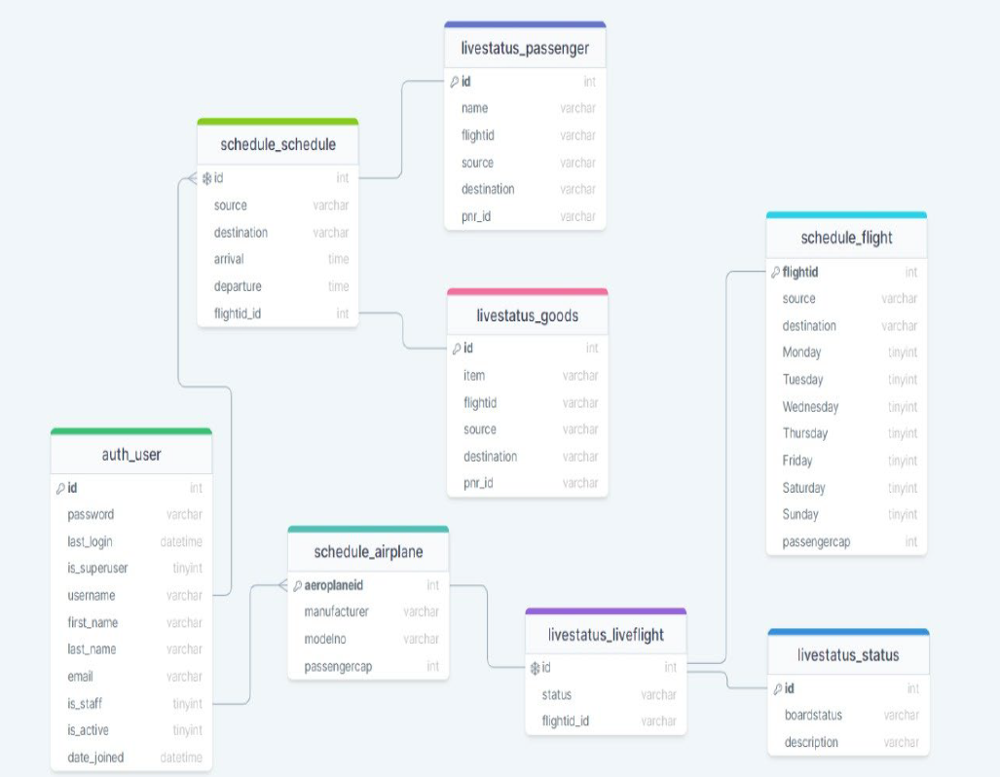

## Airport Management System: Take Flights with Ease ✈️

This project is your one-stop shop for a user-friendly airline management system built with Python, Django and MySQL.

### What's in the Hangar?

- **Effortless Booking:** Skip the long lines and book flights directly through the system, saving you valuable time and frustration ⏱️.
- **Flight Explorer:** Search and compare flights based on your travel dates and preferences.
- **Customer Central:** Manage your bookings, view flight schedules and statuses.
- **Scalable System:** Designed to handle a growing number of flights and users.

#### 1. Login Page for User

#### 2. Dashboard for User

### Contributing? We'd Love Your Help!
Feel free to submit pull requests with bug fixes or enhancements. ✨

### Built with Love by: Utkal Singh
- **Python:** Application logic and functionality
- **Django:** High-level web framework powering the user interface
- **MySQL:** Robust relational database management system
